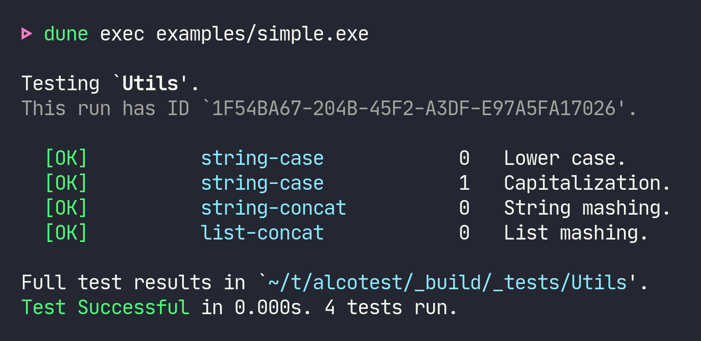
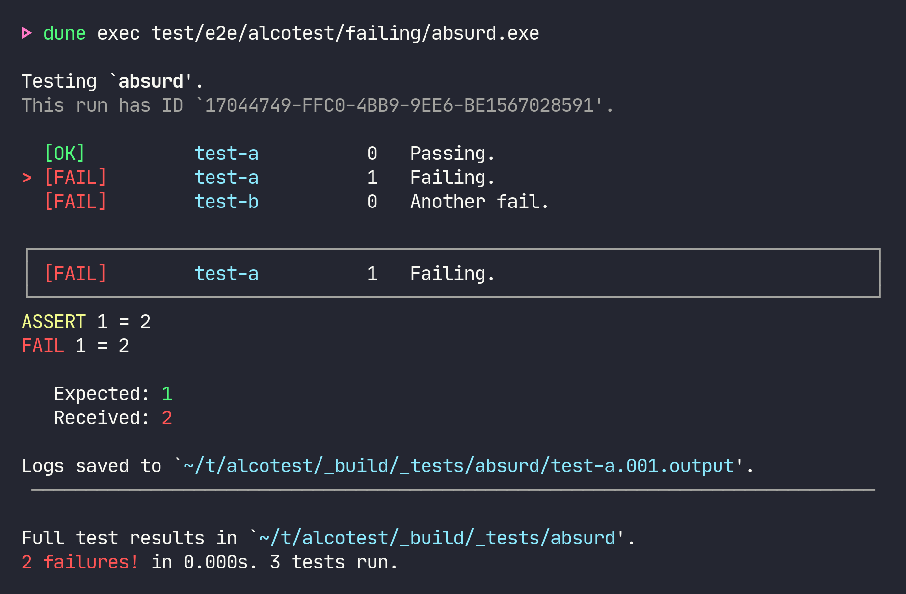

## 

Alcotest is a lightweight and colourful test framework.

Alcotest exposes simple interface to perform unit tests. It exposes
a simple `TESTABLE` module type, a `check` function to assert test
predicates and a `run` function to perform a list of `unit -> unit`
test callbacks.

Alcotest provides a quiet and colorful output where only faulty runs are fully
displayed at the end of the run (with the full logs ready to inspect), with a
simple (yet expressive) query language to select the tests to run. See [the
manpage](./alcotest-help.txt) for details.

For information on contributing to Alcotest, see
[CONTRIBUTING.md](./CONTRIBUTING.md).

[](https://ci.ocamllabs.io/github/mirage/alcotest)
[](https://travis-ci.org/mirage/alcotest)
[](https://mirage.github.io/alcotest/alcotest/index.html)

### Examples

A simple example (taken from `examples/simple.ml`):

<p align="center"></p>

Generated by the following test suite specification:

```ocaml
(* Build with `ocamlbuild -pkg alcotest simple.byte` *)

(* A module with functions to test *)
module To_test = struct
  let lowercase = String.lowercase_ascii
  let capitalize = String.capitalize_ascii
  let str_concat = String.concat ""
  let list_concat = List.append
end

(* The tests *)
let test_lowercase () =
  Alcotest.(check string) "same string" "hello!" (To_test.lowercase "hELLO!")

let test_capitalize () =
  Alcotest.(check string) "same string" "World." (To_test.capitalize "world.")

let test_str_concat () =
  Alcotest.(check string) "same string" "foobar" (To_test.str_concat ["foo"; "bar"])

let test_list_concat () =
  Alcotest.(check (list int)) "same lists" [1; 2; 3] (To_test.list_concat [1] [2; 3])

(* Run it *)
let () =
  let open Alcotest in
  run "Utils" [
      "string-case", [
          test_case "Lower case"     `Quick test_lowercase;
          test_case "Capitalization" `Quick test_capitalize;
        ];
      "string-concat", [ test_case "String mashing" `Quick test_str_concat  ];
      "list-concat",   [ test_case "List mashing"   `Slow  test_list_concat ];
    ]
```

The result is a self-contained binary which displays the test results. Use `dune
exec examples/simple.exe -- --help` to see the runtime options.

Here's an example of a of failing test suite:

<p align="center"></p>

By default, only the first failing test log is printed to the console (and all
test logs are captured on disk). Pass `--show-errors` to print all error
messages.

### Selecting tests to execute

You can filter which tests to run by supplying a regular expression matching the names
of the tests to execute, or by passing a regular expression _and_ a comma-separated list
of test numbers (or ranges of test numbers, e.g. `2,4..9`):
```shell
$ ./simple.native test '.*concat*'
Testing Utils.
[SKIP]     string-case            0   Lower case.
[SKIP]     string-case            1   Capitalization.
[OK]       string-concat          0   String mashing.
[OK]       list-concat            0   List mashing.
The full test results are available in `_build/_tests`.
Test Successful in 0.000s. 2 tests run.

$ ./simple.native test 'string-case' '1..3'
Testing Utils.
[SKIP]     string-case            0   Lower case.
[OK]       string-case            1   Capitalization.
[SKIP]     string-concat          0   String mashing.
[SKIP]     list-concat            0   List mashing.
The full test results are available in `_build/_tests`.
Test Successful in 0.000s. 1 test run.
```

Note that you cannot filter by test case name (i.e. `Lower case` or `Capitalization`), you must
filter by test name & number instead.

See the [examples](https://github.com/mirage/alcotest/tree/master/examples)
folder for more examples.

### Quick and Slow tests

In general you should use `` `Quick`` tests: tests that are ran on any
invocations of the test suite. You should only use `` `Slow`` tests for stress
tests that are ran only on occasion (typically before a release or after a major
change). These slow tests can be suppressed by passing the `-q` flag on the
command line, e.g.:

```
$ ./test.exe -q # run only the quick tests
$ ./test.exe    # run quick and slow tests
```

### Passing custom options to the tests

In most cases, the base tests are `unit -> unit` functions. However,
it is also possible to pass an extra option to all the test functions
by using `'a -> unit`, where `'a` is the type of the extra parameter.

In order to do this, you need to specify how this extra parameter is
read on the command-line, by providing a [Cmdliner term for
command-line
arguments](http://erratique.ch/software/cmdliner/doc/Cmdliner.Term.html)
which explains how to parse and serialize values of type `'a` (*note:* do not
use positional arguments, only optional arguments are supported).

For instance:

```ocaml
let test_nice i = Alcotest.(check int) "Is it a nice integer?" i 42

let int =
  let doc = "What is your prefered number?" in
  Cmdliner.Arg.(required & opt (some int) None & info ["n"] ~doc ~docv:"NUM")

let () =
  Alcotest.run_with_args "foo" int [
    "all", ["nice", `Quick, test_nice]
  ]
```

Will generate `test.exe` such that:

```
$ test.exe test
test.exe: required option -n is missing

$ test.exe test -n 42
Testing foo.
[OK]                all          0   int.
```

### Lwt

Alcotest provides an `Alcotest_lwt` module that you could use to wrap
Lwt test cases. The basic idea is that instead of providing a test
function in the form `unit -> unit`, you provide one with the type
`unit -> unit Lwt.t` and alcotest-lwt calls `Lwt_main.run` for you.

However, there are a couple of extra features:

- If an async exception occurs, it will cancel your test case for you
  and fail it (rather than exiting the process).

- You get given a switch, which will be turned off when the test case
  finishes (or fails). You can use that to free up any resources.

For instance:

```ocaml
let free () = print_endline "freeing all resources"; Lwt.return ()

let test_lwt switch () =
  Lwt_switch.add_hook (Some switch) free;
  Lwt.async (fun () -> failwith "All is broken");
  Lwt_unix.sleep 10.

let () =
  Lwt_main.run @@ Alcotest_lwt.run "foo" [
    "all", [
      Alcotest_lwt.test_case "one" `Quick test_lwt
    ]
  ]
```

Will generate:

```
$ test.exe
Testing foo.
[ERROR]             all          0   one.
-- all.000 [one.] Failed --
in _build/_tests/all.000.output:
freeing all resources
[failure] All is broken
```

### Comparison with other testing frameworks

The README is pretty clear about that:

> Alcotest is a lightweight and colourful test framework.

Alcotest is the only testing framework using colors!

More seriously, Alcotest is similar to [ounit](http://ounit.forge.ocamlcore.org/)
but it fixes a few of the problems found in that library:

- Alcotest has a nicer output, it is easier to see what failed and what
  succeeded and to read the log outputs of the failed tests;

- Alcotest uses combinators to define pretty-printers and
  comparators between the things to test.

Other nice tools doing different kind of testing also exist:

- [qcheck](https://github.com/c-cube/qcheck) qcheck does random
  generation and property testing (e.g. Quick Check)

- [crowbar](https://github.com/stedolan/crowbar)
  and [bun](https://github.com/yomimono/ocaml-bun)
  are similar to qcheck, but use compiler-directed randomness,
  e.g. it takes advantage of the AFL support  the OCaml compiler.

- [`ppx_inline_tests`](https://github.com/janestreet/ppx_inline_test)
  allows to write tests in the same file as your source-code; they
  will be run only in a special mode of compilation.
